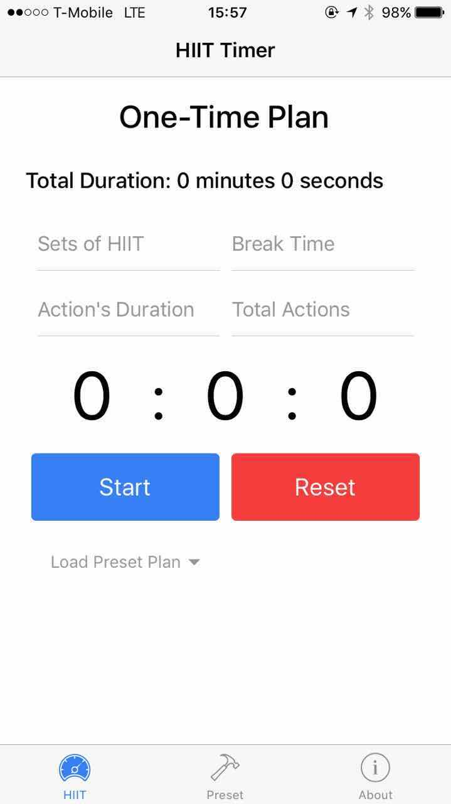
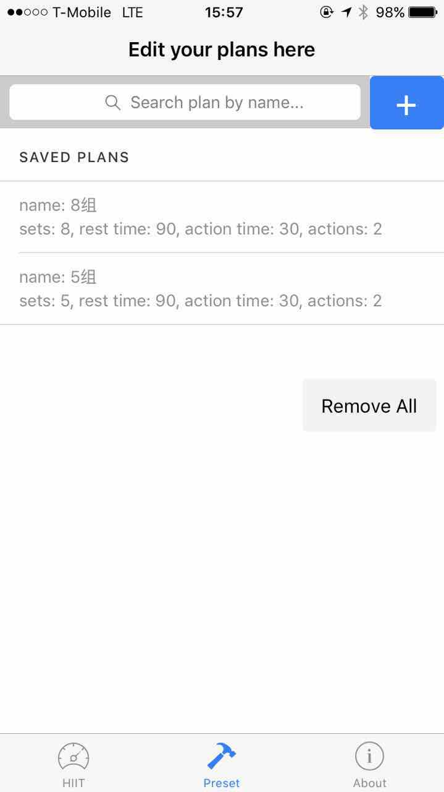
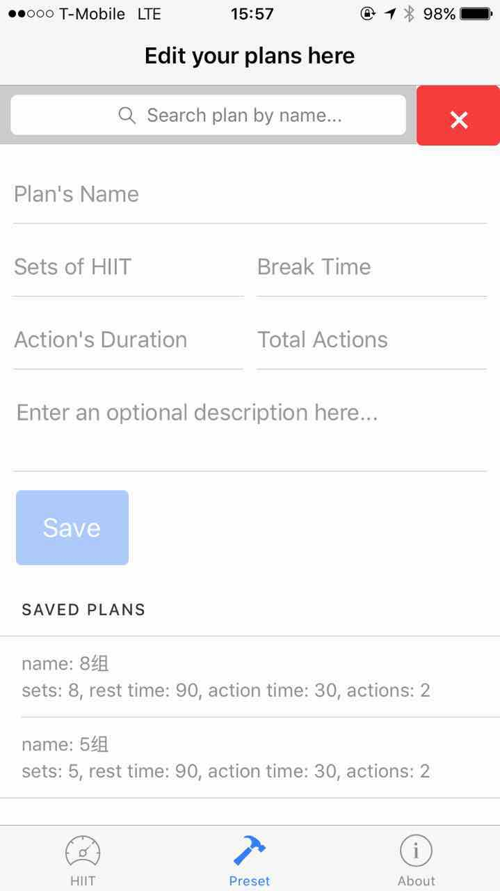

# HIIT Timer
A simple timer for HIIT exerciser.

### Compatible platforms:
- [x] IOS native
- [x] Browser (on any system)
- [ ] Android native
> High-intensity interval training, or HIIT, is on the fast track to becoming the standard for steady and sustained fat loss. It's currently the most popular exercise of all kinds.

## In-App Details
### Screenshot




### Instructions
There are already 2 default plans existing in the app. You can add more plans to it at the 'Preset Page'.

For a specific plan, there are 4 main parts you need to fill out.
- Sets: How many sets you want to do for this exercise?
- Rest Time: The duration for you to take a break.
- Actions: How many actions you want in 1 set?
- Action Time: The duration for 1 action.
> exercise flow:   
```
start -> do action1 -> do action2,3,4... -> take a break ->
       ^                                                  |
       |------------------this is one set----------------<-
```
### Features
1. Timing
2. Notify user when every action/rest time up by sound and text
3. Preset your plans

## Development Details
### Techs
1. Ionic 2 (Angular 2, Cordova)
2. TypeScript (JavaScript, EcmaScript 6)
3. Rxjs/Promise


### Installation and Run
#### Prerequisite:   
install ionic and cordova to your local: http://ionicframework.com/docs/intro/installation/

#### In local:
> npm install   
> ionic serve

#### In ios:   
please follow this instruction to install to ios:  http://ionicframework.com/docs/intro/deploying/

### Change Logs
4/3/2107 - v1.0.1: added DB, Observable    
3/25/2107 - v1.0.0: first stable version w/o DB
